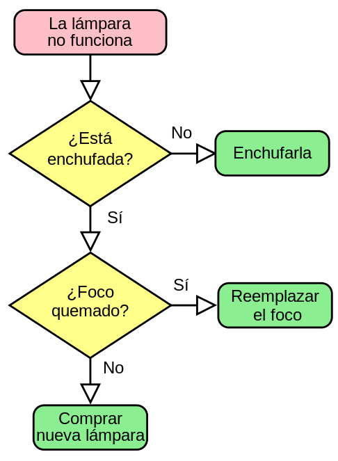
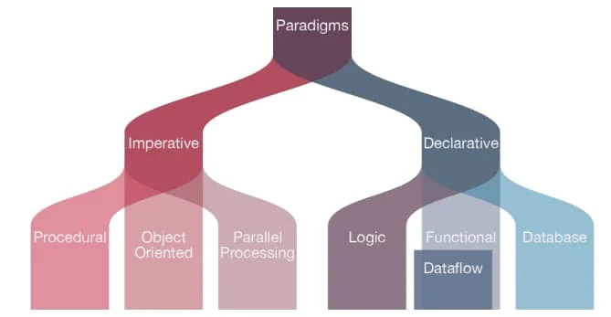

# Módulo 1 Semana 1

¡Hola! Te doy la bienvenida al Bootcamp de Desarrollo Web Fullstack. Espero que estés comenzando con mucho ánimo, ganas de aprender y sobre todo, deseos de poder compartir conocimientos y aprender en comunidad.

Como sabes, esta es tu primera semana, lo cual me llena de alegría porque estás dando un paso muy importante en tu vida. Durante esta semana, aprenderás sobre los temas iniciales de este mundo de la programación. Si tienes conocimientos previos en el área, no te preocupes, te permitirá repasar lo aprendido y brindar ayuda a tus compañeros que aún no lo saben. Te invito a iniciar este recorrido y te deseo mucho éxito en tu camino.

A continuación, se muestra el listado del contenido que aprenderás en esta semana. 

# Tabla de Contenidos
- [Introducción al contenido](#introducción-al-contenido)
- [Desarrolladoras y Desarrolladores referentes](#desarrolladoras-y-desarrolladores-referentes)
- [¿Qué es un Algoritmo?](#que-es-un-algoritmo)
- [Lenguajes de Programación](#lenguajes-de-programación)
- [Paradigmas de la Programación](#paradigmas-de-la-programación)
- [Full Stack Developer](#full-stack-developer)
- [Breve historia de la World Wide Web](#breve-historia-de-la-world-wide-web)
- [Rescatando lo importante](https://github.com/UDDBootcamp/7M_FULLSTACK_M1_S1#rescatando-lo-importante)
- [Reto de la Semana](#reto-de-la-semana)
- [Referencias](#referencias)

# Conceptos Generales del Desarrollo de Software

## Introducción al contenido

La Ingeniería de software es una de las disciplinas recién surgidas, tanto en el ámbito académico como en la industria. Aunque existen otras ingenierías que todavía tienen vigencia teórica y práctica desde hace miles de años, la Ingeniería de software tomó forma en la década de los 70. Anteriormente, esta disciplina era abordada principalmente por especialistas en matemáticas, sin embargo, con el tiempo se ha consolidado como una disciplina en la que convergen diferentes campos del conocimiento para desarrollar software de calidad.

Ahora bien, para conocer un poquito de historia, te vamos a hablar sobre algunos personajes que se iniciaron en este mundo hace años atrás.

# Desarrolladoras y Desarrolladores referentes

En todas las disciplinas existen referentes de la misma, y esta industria no es la excepción. Durante años este campo fue dominado por las y los matemáticos, donde destacan las siguientes personas:

## Ada Lovelace (1815 - 1852)

Matemática inglesa reconocida por su trabajo con la máquina analítica de Charles Baddage. Se le reconoce como la primera programadora de la historia. Te invito a leer sobre ella, tuvo una vida apasionante.


## Grace Hopper (1906 - 1992)

En la década de los 40 escribió el primer manual de programación, y posteriormente, y para el UNIVAC (uno de los primeros computadores comerciales), desarrolló el primer compilador, un software que es capaz de traducir desde un lenguaje de programación en inglés, a lenguaje de máquina. Y como si esto fuera poco, participó en la creación de los lenguajes de programación Fortran y COBOL.


## Dennis Ritchie (1941 - 2011)

En la década de los 60, trabajando para los Laboratorios Bell, diseñó el primer sistema operativo de la historia: Unix (MacOS y Linux son los herederos de este S.O.), y no conforme con esto, entre 1969 y 1973, desarrolla el lenguaje de programación C (lenguaje de programación que viene a reemplazar a B, si, la creatividad no alcanzaba para nombrar a los productos que creaban). Este lenguaje de programación (aún muy popular en ciertos círculos de programadores) es del que descienden muchos lenguajes contemporáneos: Java, C++, C#, Objective C, Swift, Python, Ruby, PHP, y un largo etc.


Y existen muchos y muchas otras desarrolladoras, pero nos gustaría destacar a 2 más:

## Bill Gates (1955)

Si bien no destaca precisamente como programador, si hizo un aporte tremendamente significativo. Creó **la industria del software**. Hasta que en 1975 lanza junto a Paul Allen el lenguaje de programación Altair BASIC, el software era un 'mal necesario', es decir, las investigaciones y el financiamiento estaban destinados al desarrollo de la industria del hardware, y el software no parecía importante, quizás apenas necesario. Pero Gates tuvo la visión necesaria para fundar Microsoft, una empresa que logró cimentar la industria del software y de paso, llevó a Gates a ser el hombre más rico del mundo durante varios años.


## Linus Torvalds (1969)

A diferencia de Gates, que es ampliamente conocido a nivel mundial ~~(incluido el 5G en las vacunas para el Covid-19)~~, Linus Torvalds no se hizo ni millonario ni tampoco tan famoso. Lo es entre los grupos de desarrolladores open source, gracias a su tremendo aporte. A principio de los 90, Torvalds estudiaba en la Universidad de Helsinki, donde comenzó a escribir un clon de Unix al que llamó Linux (un juego entre Unix y su nombre). Llevaba buena parte del kernel escrito cuando decidió compartirlo con la comunidad de desarrolladores. Fue tal el éxito de su aporte, que se sumó al trabajo de Richard Stallman para formar el sistema operativo GNU Linux, el sistema operativo más utilizado en el mundo ~~(si, mucho más que tu Windows)~~, la gran mayoría de los servidores que sostienen internet utilizan Linux, y Android tiene a Linux como su núcleo. Y no conforme con esto, también creo GIT, una herramienta de control de versiones de gran popularidad entre los desarrolladores y que tú también utilizarás durante este bootcamp.


Si lees las biografías de estos desarrolladores y desarrolladoras, notarás que salvo el último, ninguno estudió Ingeniería de Software. Como decíamos antes, es una disciplina bastante nueva.

Pero, ¿cómo es posible que los padres y madres del desarrollo de software no sean ingenieros de software?

Seguramente es porque la habilidad principal de este oficio es, sin lugar a dudas, la de implementar algoritmos.

# ¿Qué es un algoritmo?

En pocas palabras, un algoritmo es una **secuencia de pasos bien definidos que resuelven un problema**. Entonces, podríamos decir que el cálculo de impuestos es un algoritmo, así como lo es también la funcionalidad de un carrito de compras en un comercio electrónico, o los tramites que debes realizar para obtener una visa de trabajo en algún país vecino (o no tan vecino), e un manual de instrucciones de armado de tu silla gamer. Sí, estos dos últimos ejemplos suenan algo raro quizás. Pero también son algoritmos. Los algoritmos que se resuelven con matemáticas, seguramente el tipo que más asociamos al termino algoritmo, se le denomina cuantitativo. En cambio, aquellos que no se resuelven con matemáticas, se les denomina cualitativo.

Más allá de estos detalles, lo concreto es que un algoritmo lo componen aquellos pasos que permiten dar solución a un problema, y se pueden describir de diversas formas, desde el lenguaje natural, diagramas de flujos, pseudocódigo y claro está, los lenguajes de programación. A continuación algunos ejemplos:

## Lenguaje Natural

Analiza el siguiente caso:

> Cada mañana me levanto al sonar el despertador. Lo apago y me quito los cobertores que me abrigan durante la noche. Me dirijo al baño donde me desnudo, y tomo una ducha. Luego seco mi cuerpo, y me visto comenzando por la ropa interior, luego una primera capa y finalizo con una capa exterior. Una vez vestido, me dirijo a la cocina para preparar un café y comer algo de cereal, antes de coger las llaves y salir rumbo a mi trabajo.

Como puedes ver el orden de las acciones que se describen, son importantes en el resultado esperado. Si se viste antes de tomar una ducha, sería un problema ¿no?. Sin embargo, tiene inconvenientes. Suele ser ambiguo y carece de estructura.

Sin embargo, también podríamos encontrarlo dispuesto de otra forma:

> 1. Apago el despertador.
> 2. Quito los cobertores.
> 3. Me dirijo al baño.
> 4. Una vez en el baño, me desvisto.
> 5. Tomo una ducha.
> 6. ...
> 7. ...
> 8. Salgo rumbo a mi trabajo.

Es, básicamente, lo mismo. Pero resulta más explícito en el orden en que se deben ejecutar los pasos.

## Diagramas

Otra forma muy popular para describir algoritmos son los diagramas, también conocidos como diagramas de flujo o DFD, los que simplifican mucho explicar un algoritmo a un usuario.



## Pseudocódigo

El pseudocódigo es una herramienta educativa para aprender a programar. Consiste en la utilización del lenguaje natural, pero con una estructura similar a la que los lenguajes de programación implementan.

Así, el pseudocódigo implementa control de flujo, bucles, funciones, tipos de datos, arreglos, entre otros.

```pseudocodigo
Algoritmo promedioDeNotas
	definir nota1 Como Real;
	definir nota2 Como Real;
	definir nota3 Como Real;
	definir promedio Como Real;
	Escribir "Ingrese la primera nota:";
	Leer nota1;
	Escribir "Ingrese la segunda nota:";
	Leer nota2;
	Escribir "Ingrese la tercera nota:";
	promedio <- (nota1 + nota2 + nota3) / 3;
	Escribir "El promedio es : ", promedio;
FinAlgoritmo
```

# Lenguajes de Programación

Los lenguajes de programación son lenguajes formales. Esto quiere decir qué cuentan con símbolos - o alfabeto - y un conjunto de reglas - o sintaxis - que proporcionan la capacidad de escribir algoritmos que serán ejecutados por un computador.

En otras palabras, los lenguajes de programación nos permiten comunicarnos con el computador, e indicarle una serie de instrucciones - o algoritmos - que debe ejecutar para dar solución a una problemática determinada.

Así, podríamos clasificar a los lenguajes desde diversas perspectivas.

## Por su propósito
Existen los lenguajes de **propósito general**, es decir, que entregan herramientas para dar solución a cualquier tipo de problema - por ejemplo, Java, C, Python, etc. - y los lenguajes de **propósito específico**, que se especializan en dar solución a cierto tipo de problemas - como podría ser SimScript (lenguaje de programación para entornos de simulación a gran escala), Csound (lenguaje de programación para componer música) o UnrealScript (es un lenguaje de programación desarrollado por Unreal para su Unreal Tournament).

## Por su nivel de abstracción

Encontramos lenguajes de alto y de bajo nivel. Esto dice relación con su nivel de "cercanía" al procesador y demás elementos que componen el hardware. Por lo general, los lenguajes de bajo nivel son más complejos de leer y escribir que un lenguaje de alto nivel. Quizás el ejemplo más clásico de un lenguaje de bajo nivel es `assembly`, el que se compone de códigos mnemotécnicos (abreviaturas de palabras y números) de las instrucciones en binario que el procesador comprende. Esta dependencia - propia de todos los lenguajes de bajo nivel - provoca que el código escrito en este lenguaje sea muy poco portable a otras arquitecturas.

```assembly
section .data
    msg db 'Hola mundo',0

section .text
    global _start

_start:
    ; Escribir el mensaje en la consola
    mov eax, 4      ; El número de la llamada al sistema para escribir en la consola
    mov ebx, 1      ; El descriptor de archivo para la consola (stdout)
    mov ecx, msg    ; La dirección del mensaje
    mov edx, 11     ; La longitud del mensaje
    int 0x80        ; Llamar al sistema para escribir en la consola

    ; Salir del programa
    mov eax, 1      ; El número de la llamada al sistema para salir del programa
    xor ebx, ebx    ; El código de salida (0 indica éxito)
    int 0x80        ; Llamar al sistema para salir del programa
```

Este código es un programa en ensamblador - `assembly x86` para Linux - que escribe 'Hola mundo' en la consola y luego sale del programa. Se me hace.. poco legible ¿no crees?

Por otra parte, califican como lenguaje de alto nivel aquellos lenguajes de programación que están mucho más cercanos al humano - o de los y las desarrolladoras, que también nos consideramos humanos, por lo que su interpretación es mucho menos compleja. Además, en muchos casos es agnóstico del hardware por lo que su portabilidad está garantizada.

Analicemos los niveles de abstracción con un par de ejemplos que se suman al de `assembly` que acabamos de ver. Ahora veamos un par de bloques de código con un lenguaje de nivel medio, y otro de nivel alto.

```C
#include <stdio.h>

int main() {
    printf("Hola mundo\n");
    return 0;
}
```

Este pequeño programa también escribe un "hola mundo" en la consola, y fue escrito en el lenguaje `C`, un lenguaje de programación de nivel medio (entre bajo y alto nivel), diseñado originalmente para la implementación de sistemas operativos.

Esta misma funcionalidad, ahora la verás escrita en `Ruby`:
```ruby
puts "Hola mundo"
```

`Ruby` es un lenguaje de programación interpretado de alto nivel, [orientado a objetos](#programación-orientada-a-objetos) y con una sintaxis elegante y fácil de leer.

Hay varias diferencias importantes entre `C` y `Ruby`:

1. **Tipo de lenguaje**: `C` es un lenguaje de programación de nivel medio, estructurado y compilado, mientras que `Ruby` es un lenguaje de programación de alto nivel, orientado a objetos e interpretado.

2. **Sintaxis**: La sintaxis de `C` es más estricta y menos flexible que la de `Ruby`. `C` utiliza llaves para delimitar bloques de código, mientras que `Ruby` utiliza la indentación. Además, `C` requiere que se declaren las variables con un tipo específico, mientras que `Ruby` es un lenguaje de tipado dinámico.

3. **Orientación a objetos**: Aunque `C` es un lenguaje estructurado, también admite programación orientada a objetos. Sin embargo, la implementación de la programación orientada a objetos en `C` es más compleja que en `Ruby`, que es un lenguaje orientado a objetos de forma nativa.

4. **Bibliotecas y frameworks**: `Ruby` tiene una gran cantidad de bibliotecas y frameworks disponibles que facilitan el desarrollo de aplicaciones web. `C`, en cambio, tiene menos bibliotecas y frameworks disponibles, y se utiliza principalmente en la programación de sistemas y dispositivos embebidos.

Entonces, así como los lenguajes de programación se pueden clasificar según su propósito y nivel de abstracción, también debemos considerar que  los **paradigmas de programación** describen las diferentes formas en que los programas pueden estructurarse y organizarse. Cada paradigma tiene sus propias ventajas y desventajas, y algunos lenguajes de programación están diseñados para ser singularmente adecuados para un paradigma en particular. Por lo tanto, existe una relación estrecha entre los lenguajes de programación y los paradigmas de programación.

# Paradigmas de la Programación

Un paradigma de programación consiste en un método para llevar a cabo los algoritmos. Describen cómo deben organizarse y estructurarse un programa. Representa un enfoque particular o, incluso un enfoque filosófico para dar solución a determinados problemas. Por otra parte, los lenguajes de programación pueden implementar un paradigma en específico, como también pueden ser multiparadigma. Por ejemplo, Python es Orientado a Objetos, Imperativo y Funcional, en cambio, C++ es Orientado a Objetos e Imperativo.

Así, existen diversos paradigmas, explicaremos algunos a continuación.



## Paradigma Imperativo

El código consiste en una sucesión de instrucciones o conjunto de sentencias, como si él programador diera órdenes concretas. Es en definitiva, un paso a paso señalando todo lo que hará el programa. Algunos lenguajes de programación que trabajan este paradigma son COBOL, Pascal, BASIC, FORTRAN, C, entre otros.

Este paradigma cuenta con algunos enfoques que lo complementan:

### Programación Estructurada
El flujo de control se define por bucles - incluso anidados -, condiciones y subrutinas, en lugar de a través de GOTO - que permite saltar a una línea determinada.

Veamos un ejemplo de código bajo este paradigma:

```pseudocodigo
Inicio
  
  num1 = 0
  num2 = 0
  suma = 0
  
  Escribir("Ingrese el primer número: ")
  Leer(num1)
  
  Escribir("Ingrese el segundo número: ")
  Leer(num2)
  
  resultado = num1 + num2
  
  Escribir("La suma de ", num1, " y ", num2, " es ", resultado)
  
Fin
```

Este programa le pide al usuario que ingrese dos números enteros, los suma y luego imprime el resultado en la consola. Este programa sigue el paradigma de programación estructurada porque utiliza una estructura secuencial de instrucciones para realizar una tarea específica. Además, utiliza variables locales para almacenar los datos y no utiliza saltos incondicionales (como goto) para controlar el flujo del programa.

### Programación Modular
Divide el programa en módulos o subprogramas con el propósito de facilitar su escritura, manejable y legible. Es una evolución de la programación estructurada para resolver problemas de programación más complejos.

```pseudocodigo
Inicio
  Función sumar(num1, num2, resultado)
    resultado = num1 + num2
  Fin Función
  
  num1 = 0
  num2 = 0
  suma = 0
  
  Escribir("Ingrese el primer número: ")
  Leer(num1)
  
  Escribir("Ingrese el segundo número: ")
  Leer(num2)
  
  sumar(num1, num2, suma)
  
  Escribir("La suma de ", num1, " y ", num2, " es ", suma)
  
Fin
```

En este ejemplo, se ha creado una función llamada `sumar` que toma dos números enteros como argumentos y devuelve su suma. Luego, en la función `main`, se le pide al usuario que ingrese dos números enteros, se llama a la función `sumar` para sumarlos y se imprime el resultado en la consola.

Este programa sigue el paradigma de programación modular porque se ha dividido en módulos o funciones más pequeñas y cohesivas que realizan tareas específicas. Cada función tiene una tarea específica y se comunica con otras funciones a través de argumentos y valores de retorno. Esto hace que el programa sea más fácil de entender, mantener y depurar.

### Programación Procedimental
Busca la reutilización de código, limitando las cantidad de expresiones repetidas agrupando estas en procedimientos o funciones para ser llamado cuando sea requerido.

```pseudocodigo
Inicio
  Función sumar(num1, num2)
    resultado = num1 + num2
    Retornar resultado
  Fin Función
  
  num1 = 0
  num2 = 0
  suma = 0
  
  Escribir("Ingrese el primer número: ")
  Leer(num1)
  
  Escribir("Ingrese el segundo número: ")
  Leer(num2)
  
  suma = sumar(num1, num2)
  
  Escribir("La suma de ", num1, " y ", num2, " es ", suma)
  
Fin
```

En este ejemplo, se utiliza una función llamada "sumar" para realizar la operación de suma entre dos números. La función recibe dos parámetros (num1 y num2) y retorna el resultado de la suma. Luego, en el programa principal, se llama a la función "sumar" y se asigna el resultado a la variable "suma". Finalmente, se muestra el resultado en pantalla.

Este programa sigue el paradigma de programación procedimental porque utiliza una serie de procedimientos o funciones que realizan tareas específicas. Cada procedimiento tiene una tarea específica y se comunica con otros procedimientos a través de argumentos y valores de retorno. Esto hace que el programa sea más fácil de entender, mantener y depurar.

El paradigma de programación procedimental y el paradigma de programación modular tienen algunas diferencias que quizás no notes en los ejemplos anteriores, pero acá te lo hacemos más fácil de digerir: En resumen, el *paradigma de programación modular* se centra en la organización de los procedimientos o funciones en módulos cohesivos y reutilizables, mientras que el *paradigma de programación procedimental* se centra en la secuencia de procedimientos o funciones que se ejecutan para realizar una tarea. 

## Paradigma Declarativo

Este paradigma no define algoritmos, dado que describe el problema - declarando propiedades y reglas que deben cumplirse - en lugar de encontrar una solución por medio de instrucciones, como el Imperativo. Este paradigma utiliza el principio del razonamiento lógico para responder a las preguntas o cuestiones consultadas.

Este paradigma cuenta con algunos enfoques que lo describen:

- **Programación Lógica**: Se basa en la definición de relaciones lógicas. Su mejor exponente es el lenguaje Prolog.
- **Programación Funcional**: Se basa en la definición de predicados, y de corte más matemático. Sus mejores exponentes son Lisp, Scala, Java y Kotlin.

Veamos un ejemplo de cómo se podría escribir un programa utilizando el paradigma de programación declarativa: Supongamos que queremos escribir un programa que calcule el factorial de un número. En programación declarativa, podríamos definir una función "factorial" que nos permita calcular el factorial de un número. La función "factorial" podría definirse de la siguiente manera:

```pseudocodigo
factorial(0, 1).
factorial(N, F) :- N > 0, N1 es N - 1, factorial(N1, F1), F es N * F1.
```

En esta definición, la función "factorial" se define como verdadera para el caso base factorial(0, 1), es decir, el factorial de 0 es 1. Para cualquier otro número N, la función se cumple si N es mayor que 0, se calcula el factorial de N-1 (utilizando la recursividad, que significa que una función se llama a sí misma. Más adelante la veremos y comprenderemos) y se multiplica por N para obtener el factorial de N.

Una vez que hemos definido la función "factorial", podemos utilizarla para calcular el factorial de cualquier número. Por ejemplo, podríamos escribir el siguiente programa:

```pseudocodigo
?- factorial(5, F).
F = 120.
```

Finalmente, en este programa utilizamos la función "factorial" para calcular el factorial de 5 (lo cual es 120).

En programación declarativa, se definen reglas y hechos que describen el problema y se utilizan estas reglas y hechos para hacer consultas y obtener respuestas.

## Programación Reactiva
Se basa en escuchar lo que emite un evento o cambios en el flujo de datos, en donde las piezas de software reaccionan a los valores que reciben de dicho cambio. Las librerías más conocidas son React y Angular que usan RxJs para hacer uso de la programación reactiva.

Veamos un breve ejemplo; supongamos que queremos escribir un programa que monitoree el estado de un sensor y realice una acción cuando el valor del sensor supere un umbral determinado. En programación reactiva, podríamos definir un flujo de eventos que represente los valores del sensor y utilizar operadores para transformar y filtrar estos eventos. El programa podría definirse de la siguiente manera:

```pseudocodigo
sensor = FlujoDeEventos("sensor")
umbral = 10

sensor.filtrar(lambda x: x > umbral).tomar(1).suscribir(lambda x: realizar_accion())
```

En esta definición, creamos un flujo de eventos llamado "sensor" que representa los valores del sensor. Luego, utilizamos el operador "filtrar" para filtrar los eventos que superen el umbral determinado (10 en este caso). A continuación, utilizamos el operador "tomar" para tomar el primer evento que supere el umbral y finalmente utilizamos el operador "suscribir" para suscribirnos a este evento y realizar la acción correspondiente (en este caso, llamamos a la función "realizar_accion").

Una vez que hemos definido el flujo de eventos y los operadores correspondientes, el programa se ejecutará de forma reactiva, es decir, se suscribirá al flujo de eventos y realizará la acción correspondiente cuando se cumpla la condición definida.

## Programación Orientada a Objetos

El paradigma de la Orientación a Objetos (OO) se construyen modelos de objetos que representan elementos (a los que llama objetos) del problema a resolver, que tienen características y funciones. Esto permite separar los diferentes componentes de un programa, simplificando así su creación, depuración y posteriores mejoras.

La programación orientada a objetos disminuye los errores y facilita a la reutilización del código, dado que es una manera de programar que nos acerca a cómo expresaríamos las cosas en la vida real.

La OO define un objeto como una estructura abstracta que describe un objeto del mundo real así como su relación con el mundo que lo rodea a través de interfaces. Para ello, utiliza diferentes conceptos como:

- Abstracción
- Encapsulación
- Herencia
- Polimorfismo

Algunos lenguajes de programación exponentes de este paradigma son Java, Python y C#, entre muchos otros.

Veamos un breve ejemplo; supongamos que queremos escribir un programa que modele una cuenta bancaria. En programación orientada a objetos, podríamos definir una clase "CuentaBancaria" que tenga atributos como el número de cuenta, el saldo y los titulares de la cuenta, y métodos como "depositar", "retirar" y "consultarSaldo". La clase "CuentaBancaria" podría definirse de la siguiente manera:

```pseudocodigo
clase CuentaBancaria:
  atributos:
    numeroCuenta
    saldo
    titulares
  
  métodos:
    constructor(numeroCuenta, saldoInicial, titulares)
      this.numeroCuenta = numeroCuenta
      this.saldo = saldoInicial
      this.titulares = titulares
    
    depositar(cantidad)
      this.saldo = this.saldo + cantidad
    
    retirar(cantidad)
      si cantidad > this.saldo:
        imprimir("Error: saldo insuficiente")
      sino:
        this.saldo = this.saldo - cantidad
    
    consultarSaldo()
      imprimir("El saldo de la cuenta ", this.numeroCuenta, " es ", this.saldo)
```

El método "constructor" se utiliza para inicializar los atributos de la cuenta bancaria. El método "depositar" se utiliza para depositar una cantidad de dinero en la cuenta. El método "retirar" se utiliza para retirar una cantidad de dinero de la cuenta, siempre y cuando haya suficiente saldo disponible. El método "consultarSaldo" se utiliza para imprimir el saldo actual de la cuenta.

Una vez que hemos definido la clase "CuentaBancaria", podemos utilizarla para crear objetos que representen cuentas bancarias y llamar a los métodos correspondientes para realizar operaciones en estas cuentas. Por ejemplo, podríamos escribir el siguiente programa:

```pseudocodigo
cuenta1 = CuentaBancaria("123456", 1000, ["Juan Perez"])
cuenta1.depositar(500)
cuenta1.retirar(200)
cuenta1.consultarSaldo()
```

En este programa, creamos un objeto "cuenta1" de la clase "CuentaBancaria" con el número de cuenta "123456", un saldo inicial de 1000 y un titular "Juan Perez". Luego, depositamos 500 en la cuenta, retiramos 200 y consultamos el saldo actual de la cuenta.

En programación orientada a objetos, se definen clases que representan objetos del mundo real y se utilizan estos objetos para realizar operaciones y manipular datos.

Como puedes ver, los paradigmas de la programación describen diferentes enfoques para resolver problemas de programación. Estos enfoques pueden influir en la forma en que se desarrolla una aplicación y en las habilidades necesarias para construirla. Con eso presente, un desarrollador Full Stack debe contar con conocimientos tanto de paradigmas de programación, pasando por la interfaz de usuario hasta la base de datos y todo lo demás. A continuación revisémoslo con mayor detalle.

# Full Stack Developer

Antes de comprender qué rol cumple un desarrollador Full Stack, debemos analizar los términos **FrontEnd**, **BackEnd** y **Stack**, los que describen los componentes de una aplicación o sitio web con tecnologías y objetivos distintos.

## Frontend

Por una parte, Frontend es la parte del desarrollo que se dedica a la parte frontal, es decir, a aquello que el usuario ve y con lo que puede interactuar. En una aplicación web, se utilizan tecnologías como HTML, CSS (lenguajes de marcado y estilo respectivamente) y JavaScript (lenguaje de programación).

De estas tecnologías surgen una gran variedad de frameworks y librerías que facilitan la creación de interfaces atractivas y que generan una gran experiencia de usuario. Entre ellas destacan React, Angular, Bootstrap, LESS, SASS, PostCSS, y un largo etc.

## Backend

Por otra parte, el Backend son aquellos elementos que procesan la información, implementan las reglas de negocio - es decir, implementan los algoritmos que responden las preguntas que él software busca responder - y alimentan de datos al Frontend. Esta "capa" queda oculta al usuario, no se entera de qué existe, pero es crucial para el correcto funcionamiento de la aplicación.

Trabajar en el Backend supone algo totalmente diferente al Frontend, ya que exige el dominio de otros términos de programación, lenguajes que requieren otra lógica, ya que esta área es también la encargada de optimizar recursos, de la seguridad del software y otros factores.

En Backend también existen frameworks que facilitan el desarrollo y optimizan los recursos. Entre otros destacan Spring Boot, Django, Express.js y muchos otros.

## Stack

Corresponde a un conjunto de tecnologías y herramientas que se utilizan para desarrollar una aplicación, es decir, son todas las tecnologías que usa tanto él Frontend y el Backend.

Algunos Stack populares son:

- **MERN**: MongoDB - un motor de bases de datos noSql -, ExpressJS, React y NodeJS.
- **MEAN**: MongoDB, ExpressJS, Angular y NodeJS.
- **MEVN**: MongoDB, ExpressJS, Vue y NodeJS.
- **LAMP**: Linux, Apache, Mysql y PHP, Pearl o Python. Fue tremendamente popular durante muchos años, y seguramente cimentó (mayoritariamente con PHP) el internet que hoy conocemos.
- **MAMP**: macOS, Apache, Mysql y PHP, Pearl o Python.

Otras combinaciones de tecnologías son también muy usadas, pero se combinan de acuerdo a las necesidades de cada proyecto.

## Full Stack

El Desarrollador Full Stack es un profesional versátil, capaz de desempeñarse en ambas disciplinas (Backend y Frontend), en un stack como los descritos anteriormente, o con las combinaciones que el proyecto requiera - por ejemplo, Java en el Backend, Angular para el Frontend y Oracle como base de datos -, y aportar en cualquier fase de la construcción del software.

Sin embargo, y a diferencia de como habitualmente se cree, este perfil no es una figura que deba hacerlo todo. Lo que realmente debe hacer es comprender ambas áreas de la programación, y atender los desafíos que ambas áreas presentan.

# Breve historia de la World Wide Web

**1969:** El Departamento de Defensa de los Estados Unidos desarrolla una red que conectaba varias universidades californianas, llamada ARPANET.

**1969 - 1991:** ARPANET se fue extendiendo en los centros académicos y militares de todo el mundo adoptando TCP/IP de paso. En un principio la comunicación entre ordenadores era muy básica, sólo se intercambiaban mensajes o se ofrecía un acceso directo a los archivos compartidos en la red.

**1989:** Tim Berners-Lee, junto con el equipo con el que trabajaba en el CERN, inventó y desarrolló el protocolo de comunicación HTTP, el sistema de direcciones por medio de URLs y el HTML, lo cual permitía crear páginas con texto e imágenes que se enlazaban entre sí.

**1991:** ARPANET se vuelve pública. Tim-Bernes Lee y su equipo crearon el primer navegador web llamado "WorldWideWeb" que sólo funcionaba en computadoras NeXT y renderizaba solamente texto. (Primera página web de la historia: [http://info.cern.ch/hypertext/WWW/TheProject.html](http://info.cern.ch/hypertext/WWW/TheProject.html)).

**1993:** Se crea Mosaic, el primer explorador web gráfico multiplataforma (Disponible para Mac, Windows y otros) al ser multiplataforma fue muy popular en los círculos académicos. Fue desarrollado en el NCSA (National Center for Supercomputing Applications) por Marc Andreessen y Eric Bina.

**1993:** Se crea el primer buscador de la historia AliWeb, el cual era un índice o lista recopilada a mano de varios sitios web.

**1994:** Se lanza al público Netscape Navigator, el primer navegador web de uso comercial, también desarrollado por Marc Andreeseen. El acceso a internet en esos momentos era muy limitado, lento y caro.

**1994:** Se crea el W3C (World Wide Web Consortium) el cual genera recomendaciones y estándares que fomentan el crecimiento de la web. Dirigido por Tim Berners-Lee hasta la actualidad.

**1995:** Microsoft lanza Internet Explorer, como parte de su sistema operativo Windows 95, lo que permitió que se convirtiera en el explorador dominante.

**1995:** Netscape desarrolla y lanza JavaScript, que permitía acceder al HTML de una página web por medio del DOM para volverla más dinámica.

**1996:** Se crea CSS, que permite estilizar una página web y cambiar su estilo visual y diseño.

**1997:** Nace Google.

**1998 - 2001:** Se adaptan los lenguajes de programación para ser usados del lado del servidor (Perl, Python y Ruby) o se crean nuevos lenguajes como PHP y haciendo uso de las tecnologías existentes (HTML, CSS, Flash y Javascript) la web se vuelve más interactiva y atractiva para los usuarios. El internet es más accesible y barato.

**2002 - Actualidad:** Se desarrolla de manera orgánica la Web 2.0, la cual es una evolución de las primeras páginas web. Boom de las páginas web y la burbuja de las .com explota. Surge la web social, páginas como MySpace, Facebook, YouTube se vuelven imprescindibles. El internet es ampliamente usado y asequible para la mayoría.

**2005:** Google lanza el paper de su algoritmo MapReduce, el cual permitía desarrollar un ranking de las páginas buscadas de forma distribuida, permitiendo su implementación open source, la cual se usa para desarrollar redes distribuidas, base de la computación en la nube actual.

**2009:** Se publica MongoDB, un motor de base de datos NoSQL que surge como alternativa a las bases de datos relacionales, con el cual se intenta flexibilizar el guardado y manejo de grandes cantidades de información.

**2010:** Nace NodeJS, motor de tiempo de ejecución de javascript del lado del servidor.

**2013:** Se desarrolla y publica la primera versión de ReactJS, librería de código abierto para crear interfaces de usuario en JavaScript, creado por un equipo de desarrollo de Facebook.

**Actualidad - Futuro:** W3C genera estándares para la web semántica, lo que permite y permitirá que las máquinas se entiendan entre sí, de tal manera que los metadatos describan una aplicación web, por lo que un cliente automatizado podrá consumir otro cliente, entendiéndolo desde su contexto.

# Rescatando lo importante
Debo confesar que la historia de la programación me parece fascinante! Y qué decir de la algoritmia, la piedra angular de este oficio. Y eso solo fue la preparación para conocer los lenguajes de programación, así como los paradigmas que despliegan. 

Durante el transcurso de este Bootcamp, conoceremos con mayor detalle algunos de los paradigmas que conocimos, lo que nos permitirá dar solución a los desafíos que nos presentamos semana a semana.

Que tengas una gran semana!

# Reto de la Semana
Como aprendimos, existen múltiples paradigmas de programación. Citemos lo antes visto:

> Un paradigma de programación consiste en un método para llevar a cabo los algoritmos. Describen cómo deben organizarse y estructurarse un programa. Representa un enfoque particular o, incluso un enfoque filosófico para dar solución a determinados problemas. Por otra parte, los lenguajes de programación pueden implementar un paradigma en específico, como también pueden ser multiparadigma. Por ejemplo, Python es Orientado a Objetos, Imperativo y Funcional, en cambio, C++ es Orientado a Objetos e Imperativo.

Tu Coach organizará a los equipos de acuerdo a la cantidad de compañeros y compañeras que conformen el grupo. Y al azar, les designará un tema a investigar, de los siguientes. Recuerda que el coach puede hacer adecuaciones a lo descrito en este proyecto, dependiendo de factores que considere relevantes):

- Programación Imperativa -> Estructurada
- Programación Imperativa -> Modular y Procedimental
- Programación Declarativa
- Programación Reactiva
- Programación Orientada a Objetos

## Requisitos
Ahora, considera que la investigación de tu equipo responda preguntas como - pero no limitándose a - las que siguen, porque al menos estas, serán evaluadas:

1. ¿En qué consiste este paradigma de la programación?
2. ¿Qué problema o problemas intenta resolver?
3. Háblanos brevemente sobre su historia.
4. ¿Qué lenguajes de programación lo implementan? (recuerda que muchos lenguajes son multiparadigma).
5. ¿En qué escenario hipotético utilizarías este paradigma?


# Referencias

- Ada Lovelace en Wikipedia: [https://es.wikipedia.org/wiki/Ada_Lovelace](https://es.wikipedia.org/wiki/Ada_Lovelace)
- Grace Hopper en Wikipedia: [https://es.wikipedia.org/wiki/Grace_Murray_Hopper](https://es.wikipedia.org/wiki/Grace_Murray_Hopper)
- Dennis Ritchie en Wikipedia: [https://es.wikipedia.org/wiki/Dennis_Ritchie](https://es.wikipedia.org/wiki/Dennis_Ritchie)
- Bill Gates en Wikipedia: [https://es.wikipedia.org/wiki/Bill_Gates](https://es.wikipedia.org/wiki/Bill_Gates)
- Linus Torvalds en Wikipedia:  [https://es.wikipedia.org/wiki/Linus_Torvalds](https://es.wikipedia.org/wiki/Linus_Torvalds)
- ¿Que es un algoritmo? en PandoraFMS: [https://pandorafms.com/blog/es/que-es-un-algoritmo/](https://pandorafms.com/blog/es/que-es-un-algoritmo/)
- Tipos de lenguajes de programación en Assembler Institute of Tecnology: [https://assemblerinstitute.com/blog/tipos-lenguaje-programacion/](https://assemblerinstitute.com/blog/tipos-lenguaje-programacion/)
- ¿Que son los paradigmas de programación? en EDTeam: [https://ed.team/blog/que-son-los-paradigmas-de-programacion-cf5554db-9498-475e-b281-981c4fa0f841](https://ed.team/blog/que-son-los-paradigmas-de-programacion-cf5554db-9498-475e-b281-981c4fa0f841)
- Desarrollador Full Stack: qué es, qué hace y qué necesita saber en profile.es: [https://profile.es/blog/desarrollador-full-stack/](https://profile.es/blog/desarrollador-full-stack/)
